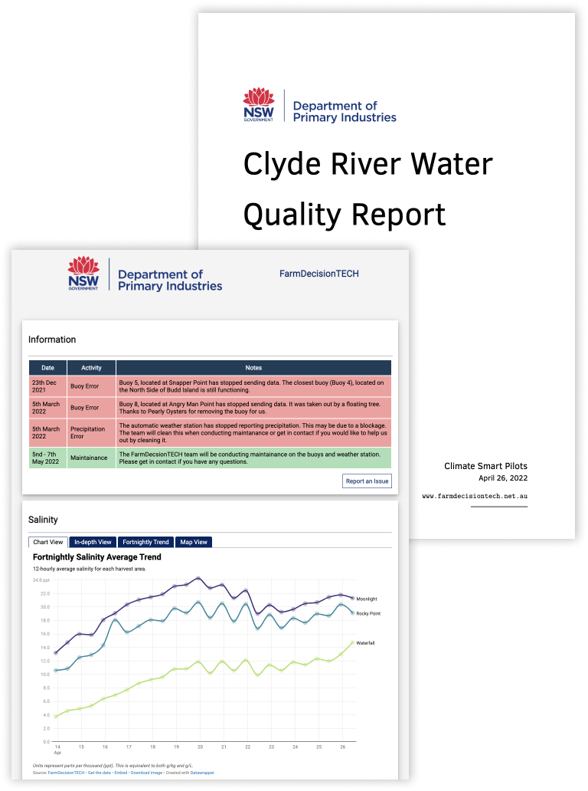

## Pilot Reports for Climate Smart Pilots
<a href="https://dpiclimate.github.io/pilot-reports/"></a>

Provides farmers and other stakeholders with up-to-date and historical data regarding environmental conditions. Currently supporting oyster farmers operating on the Clyde River (South Coast of NSW).



### Clyde River Water Quality Report

[Website](https://dpiclimate.github.io/pilot-reports/) - Built using plain HTML and JS

[PDF Report](https://dpiclimate.github.io/pilot-reports/pdf/src/report.pdf) -  Built using LaTeX

### Install and Run

[Install rust](https://www.rust-lang.org/tools/install):

```bash
curl --proto '=https' --tlsv1.2 -sSf https://sh.rustup.rs | sh
```

Download this repository:

```bash
git clone https://github.com/DPIclimate/pilot-reports
cd pilot-reports
```

Create `.env` file with [Ubidots](https://www.ubidots.com/) API token and [Datawrapper](https://www.datawrapper.de/) API token:

```bash
touch .env
echo "ORG_KEY=UBIDOTS_KEY" >> .env # Organisation key
echo "AWS_ORG_KEY=UBIDOTS_AWS_KEY" >> .env # Automatic weather station key
echo "DW_KEY=DATAWRAPPER_KEY" >> .env # For datawrapper.de
```

Build and run using cargo:

```bash
cargo build
cargo run
```

## License
Pilot-reports are MIT licensed, as found in the [LICENSE](https://github.com/DPIclimate/pilot-reports/blob/master/LICENSE) file.
